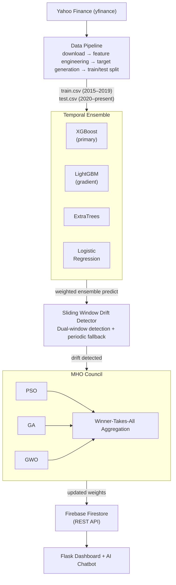

# Adaptive Machine Learning Models for Streaming Financial Data Using Meta-Heuristic Optimization

---

## Table of Contents

- [Abstract](#abstract)
- [1. Introduction to the Problem](#1-introduction-to-the-problem)
- [2. Description of Existing Work](#2-description-of-existing-work)
- [3. Theoretical Comparison Between Existing and Proposed Methodology](#3-theoretical-comparison-between-existing-and-proposed-methodology)
- [4. Proposed Methodology](#4-proposed-methodology)
- [5. Implementation Details](#5-implementation-details)
- [6. Comparative Study Between Existing and Proposed Work](#6-comparative-study-between-existing-and-proposed-work)
- [7. Conclusion with Possible Future Enhancement Suggestions](#7-conclusion-with-possible-future-enhancement-suggestions)
- [8. Appendix](#8-appendix)
- [References](#references)

---

## Abstract

Financial markets are inherently non-stationary environments where the statistical properties of data distributions shift over time — a phenomenon known as concept drift. Traditional machine learning models trained on historical data often suffer significant performance degradation when deployed in live market conditions due to these distributional shifts. This report presents **Finstream MetaOpt**, an adaptive machine learning system that combines a temporal ensemble of diverse classifiers (XGBoost, LightGBM, ExtraTrees, and Logistic Regression) with a Meta-Heuristic Optimization (MHO) Council comprising Particle Swarm Optimization (PSO), Genetic Algorithm (GA), and Grey Wolf Optimizer (GWO). The system continuously monitors the streaming NIFTY 50 index data for concept drift using a dual-window sliding detector and triggers automatic reoptimization of ensemble weights when drift is detected. Experimental evaluation over the 2020–2025 test period — which includes the COVID-19 market crash — demonstrates that the adaptive system consistently outperforms its static counterpart in Brier Score accuracy, achieving a rolling 30-day Brier Score that remains above 80% throughout most of the evaluation period. The system is deployed as a live prediction service with daily predictions at 09:30 IST, a Flask-based monitoring dashboard, Firebase Firestore persistence, and an AI-powered chatbot for interactive data queries.

---

## 1. Introduction to the Problem

### 1.1 Background

Stock market prediction has been one of the most challenging problems in computational finance. The NIFTY 50 index, which represents the weighted average of 50 of the largest Indian companies listed on the National Stock Exchange (NSE), is influenced by a multitude of factors including macroeconomic indicators, geopolitical events, investor sentiment, and institutional trading patterns. These factors change over time, causing the underlying data distributions to shift — a phenomenon formally known as **concept drift**.

### 1.2 Problem Statement

The core problem addressed in this work is: **How can a machine learning system maintain high predictive accuracy on streaming financial data when the statistical relationships between features and targets change over time?**

Specifically, the system predicts the 5-day directional movement of the NIFTY 50 index:

- **Target = 1** if the closing price 5 trading days in the future is higher than the current closing price.
- **Target = 0** otherwise.

### 1.3 Challenges

1. **Non-stationarity**: Financial time series violate the i.i.d. assumption that most ML models rely on. Market regimes (bull, bear, sideways, volatile) rotate unpredictably.
2. **Concept drift**: The relationship between technical indicators and future price movement changes across different market conditions (e.g., momentum strategies may work in trending markets but fail in mean-reverting regimes).
3. **Limited labelled data**: Each prediction resolves only after 5 trading days, creating a delayed feedback loop.
4. **Ensemble weight staleness**: A fixed ensemble weighting scheme cannot adapt to regime changes where one model becomes more accurate than others.
5. **Real-time deployment**: The system must operate in production with daily predictions, automated evaluation, state persistence, and monitoring.

### 1.4 Motivation

The 2020 COVID-19 market crash serves as a canonical example of concept drift in financial data. Models trained on 2015–2019 data experienced extreme distributional shift when applied to March 2020 data. This event motivates the need for an adaptive system that can detect such shifts and automatically recalibrate its predictions.

---

## 2. Description of Existing Work

### 2.1 Static Ensemble Methods

Traditional ensemble methods for financial prediction include:

- **Bagging** (e.g., Random Forest): Reduces variance by training multiple models on bootstrap samples. However, all models share the same training distribution and cannot adapt to new regimes.
- **Boosting** (e.g., XGBoost, LightGBM): Sequentially corrects errors from previous models. While powerful for static datasets, boosted ensembles become stale when deployed on non-stationary streams.
- **Stacking**: Combines heterogeneous base learners with a meta-learner. The meta-learner weights are fixed after training and do not adapt to distributional changes.

### 2.2 Drift Detection Approaches

- **ADWIN (Adaptive Windowing)** by Bifet and Gavaldà (2007): Maintains a variable-length window of recent observations and detects changes in the distribution mean. While effective for abrupt drift, it struggles with gradual drift when the error signal is stationary in mean but shifts in local behavior.
- **DDM (Drift Detection Method)** by Gama et al. (2004): Monitors error rate and its standard deviation. Triggers drift when error exceeds a threshold. Sensitive to the choice of threshold.
- **Page-Hinkley Test**: A sequential analysis technique for detecting changes in the average of a Gaussian signal.

### 2.3 Meta-Heuristic Optimization in ML

- **PSO for feature selection**: Kennedy and Eberhart's PSO has been applied to feature subset selection in classification tasks. Each particle represents a binary feature mask.
- **GA for hyperparameter tuning**: Genetic Algorithms have been used for optimizing ML hyperparameters, treating them as chromosomes undergoing selection, crossover, and mutation.
- **GWO**: Mirjalili et al.'s Grey Wolf Optimizer mimics the hunting behavior of grey wolves and has been applied to various optimization problems including neural network weight optimization.

### 2.4 Limitations of Existing Work

| Limitation | Description |
|---|---|
| Static weights | Ensemble weights are fixed at training time and cannot adapt to regime changes |
| Single optimizer | Most approaches use a single meta-heuristic, missing the diversity benefits of multiple optimization strategies |
| No council mechanism | Existing MHO approaches do not aggregate multiple optimizer solutions or learn which optimizer performs best over time |
| Binary drift response | Systems either retrain from scratch (expensive) or do nothing — no lightweight recalibration mechanism |
| No production deployment | Most academic systems are evaluated offline without live prediction infrastructure |

---

## 3. Theoretical Comparison Between Existing and Proposed Methodology

| Aspect | Existing Static Approach | Proposed Adaptive MHO Approach |
|---|---|---|
| **Ensemble Weights** | Fixed at training time (e.g., equal 1/N) | Dynamically optimized by MHO Council upon drift detection |
| **Drift Detection** | None, or single-method (ADWIN only) | Dual-window sliding detector with periodic fallback trigger |
| **Optimization** | Grid search or single meta-heuristic | Council of 3 algorithms (PSO, GA, GWO) with winner-takes-all aggregation |
| **Feature Selection** | Static feature set | Dynamic feature flag optimization (8-dimensional binary search space) |
| **Model Diversity** | Single model or homogeneous ensemble | Temporal ensemble with 4 heterogeneous classifiers (XGBoost, LightGBM, ExtraTrees, Logistic Regression) trained on overlapping windows |
| **Adaptation Cost** | Full retraining (expensive) | Lightweight weight reoptimization only (base models are never retrained) |
| **Fitness Function** | Accuracy or single metric | Temporally-weighted Brier Score with exponential decay (λ=0.94, half-life ≈11 steps) |
| **Safety Mechanism** | None | Regression guard: reverts to current weights if new solution is worse by >1% |
| **Convergence Speed** | N/A | Warm-start initialization with accuracy-proportional weights across all three optimizers |
| **Deployment** | Offline evaluation | Live daily predictions, Firebase persistence, Flask dashboard, AI chatbot |

### 3.1 Key Theoretical Advantages

1. **Council Diversity**: By running PSO, GA, and GWO independently, the system leverages different search strategies (swarm intelligence, evolutionary selection, and wolf pack hierarchy). This reduces the risk of converging to a poor local optimum.

2. **Temporal Weighting**: The fitness function uses exponential decay (λ=0.94) to weight recent observations more heavily. This ensures the optimizer responds to the current regime rather than being diluted by older, potentially irrelevant data.

3. **No-Worse-Than-Static Guard**: The regression guard (threshold=0.01) ensures the system never degrades below the performance of the current configuration, providing a safety floor.

4. **Winner-Takes-All Aggregation**: Unlike weighted blending which dilutes the best solution with weaker ones, the council selects the single best-performing algorithm's solution. This prevents contamination of good solutions by poor ones.

---

## 4. Proposed Methodology

### 4.1 System Overview

The proposed system, **Finstream MetaOpt**, consists of five major components:

1. **Data Pipeline**: Ingests NIFTY 50 OHLCV data from Yahoo Finance, computes 11 technical indicators, generates binary 5-day directional targets, and splits data chronologically.
2. **Temporal Ensemble**: Four heterogeneous classifiers trained on overlapping historical windows to capture different market regime characteristics.
3. **Drift Detector**: A custom dual-window sliding detector that monitors binary prediction errors for distributional shifts.
4. **MHO Council**: Three independent meta-heuristic optimizers (PSO, GA, GWO) that reoptimize ensemble weights when drift is detected.
5. **Live Deployment**: Flask web server, Firebase Firestore persistence, scheduled daily jobs, and an AI chatbot.

### 4.2 System Architecture



### 4.3 Feature Engineering

Eleven technical indicators are computed from daily OHLCV data:

| # | Feature | Description |
|---|---|---|
| 1 | `RSI_14` | Relative Strength Index (14-day window) |
| 2 | `MACD` | MACD line (12/26 EMA) |
| 3 | `MACD_Signal` | 9-day EMA of MACD |
| 4 | `MACD_Diff` | MACD histogram (MACD − Signal) |
| 5 | `BB_Position` | Bollinger Band %B (20-day, 2σ) |
| 6 | `MA_5_20_Ratio` | Ratio of 5-day MA to 20-day MA |
| 7 | `Volume_Change_Pct` | Daily volume change %, clipped to ±200% |
| 8 | `Yesterday_Return` | Previous day's close-to-close return |
| 9 | `MA_50` | 50-day moving average |
| 10 | `MA_200` | 200-day moving average |
| 11 | `Institutional_Flow` | Synthetic institutional flow index |

### 4.4 Drift Detection Algorithm

The custom **Sliding Window Drift Detector** addresses limitations of ADWIN for this specific domain:

**Dual-Window Comparison:**
- Maintains a **recent window** (last 30 resolved predictions) and a **baseline window** (200 predictions).
- If `recent_error_rate − baseline_error_rate > threshold (0.04)`, drift is declared.

**Periodic Fallback:**
- Every 150 resolved predictions, a forced reoptimization is triggered regardless of error rate changes.
- This ensures the system adapts to gradual drift that may not trigger the window-based detector.

**Cooldown Mechanism:**
- After a drift event, a cooldown period equal to the recent window size prevents back-to-back triggers from consuming resources.

### 4.5 MHO Council Optimization

Upon drift detection, the MHO Council executes:

1. **Precompute** model probabilities on the resolved window (efficiency optimization — avoids redundant `predict_proba` calls during search).
2. **Run PSO** (30 particles × 50 iterations) with warm-start from accuracy-proportional weights.
3. **Run GA** (30 individuals × 50 generations) with elitism (top 2), tournament selection (size 3), uniform crossover, and Gaussian mutation.
4. **Run GWO** (30 wolves × 50 iterations) with alpha-beta-delta hierarchy and warm-started candidate alpha.
5. **Winner-Takes-All** selection: the algorithm with the highest fitness provides the final solution.
6. **Regression Guard**: if the new solution's fitness is worse than the current solution by more than 1%, the update is suppressed.
7. **Weight Clipping**: ensemble weights are clipped to [5%, 80%] per model and renormalized.

---

## 5. Implementation Details

### 5.1 Technology Stack

| Component | Technology |
|---|---|
| Language | Python 3.13+ |
| ML Framework | XGBoost, LightGBM, scikit-learn |
| Technical Indicators | `ta` library |
| Data Source | Yahoo Finance via `yfinance` |
| Drift Detection | Custom sliding window (replaced `river.ADWIN`) |
| Web Framework | Flask + Gunicorn |
| Database | Google Cloud Firestore (REST API) |
| Scheduler | APScheduler (BlockingScheduler) |
| Chatbot | AWS Chalice + Amazon Bedrock (Llama 4 Maverick) |
| Deployment | Render (Gunicorn, 300s timeout) |

### 5.2 Project Structure

```
finstream-metaopt/
├── src/
│   ├── pipeline.py              # Data pipeline orchestrator
│   ├── data_ingestion.py        # yfinance NIFTY 50 downloader
│   ├── feature_engineering.py   # Technical indicator computation
│   ├── target_generation.py     # 5-day forward return binary target
│   ├── dataset_splitting.py     # Chronological train/test/eval splits
│   ├── 02_train_models.py       # Model training with temporal windows
│   ├── 03_stream_loop.py        # Simulation stream loop + drift detection
│   ├── 05_mho_council.py        # PSO, GA, GWO + council aggregation
│   ├── 07_scheduler.py          # Daily prediction and evaluation scheduler
│   ├── firebase_client.py       # Firestore REST API wrapper
│   └── app.py                   # Flask dashboard and REST API
├── chatbot/
│   ├── app.py                   # AWS Chalice chatbot
│   └── chalicelib/              # Agent tools and skills
├── models/                      # Serialized model artifacts (.pkl)
├── static/                      # Frontend assets (JS, CSS)
├── templates/                   # Jinja2 HTML templates
├── Procfile                     # Gunicorn entry point
├── requirements.txt             # Python dependencies
└── pyproject.toml               # Project metadata
```

### 5.3 Model Training

Four classifiers are trained on the full 2015–2019 training period:

| Model | Algorithm | Key Hyperparameters |
|---|---|---|
| XGBoost | Gradient Boosted Trees | `max_depth=3`, `lr=0.03`, `n_estimators=1000`, `subsample=0.7` |
| LightGBM | Gradient Boosted Trees | Auto-tuned via `RandomizedSearchCV` with `TimeSeriesSplit` |
| ExtraTrees | Extremely Randomized Trees | Auto-tuned via `RandomizedSearchCV` with `TimeSeriesSplit` |
| Logistic Regression | Linear Model | `StandardScaler` pipeline, L2 regularization |

Training uses a strict **chronological 80/20 train/validation split** — no shuffling to prevent data leakage.

### 5.4 Ensemble Prediction

The ensemble prediction is computed as:

```
P(ensemble) = w_xgb · P(xgb) + w_lgbm · P(lgbm) + w_et · P(et) + w_lr · P(lr)
```

Where `w_i` are the adaptive ensemble weights (sum to 1) and `P(model_i)` is the predicted probability of the positive class (price increase).

The final binary prediction is: **1** if `P(ensemble) > 0.5`, else **0**.

### 5.5 Fitness Function

The temporally-weighted Brier Score fitness:

```
fitness = 1 − mean(time_weights · (P(ensemble) − y_true)²)
```

Where:
- `time_weights[i] = λ^(n-1-i)` with `λ = 0.94` (exponential decay, half-life ≈ 11 steps)
- `time_weights` are normalized to preserve the scale: `time_weights = time_weights / sum(time_weights) × n`

This ensures the optimizer prioritizes accuracy on the most recent market regime.

### 5.6 Live Scheduler

Two jobs run daily on NIFTY trading days:

| Job | Time (IST) | Action |
|---|---|---|
| `daily_predict` | 09:30 | Fetch latest 60 days → engineer features → ensemble predict → save to Firebase |
| `daily_evaluate` | 09:35 | Evaluate prediction from 5 business days ago → update drift detector → trigger council if drift |

State (active features, ensemble weights) persists in Firestore under `system/current` and is restored on startup.

### 5.7 REST API Endpoints

| Endpoint | Description |
|---|---|
| `GET /` | Dashboard UI |
| `GET /api/summary` | Simulation summary metrics |
| `GET /api/simulation` | Full adaptive vs. static simulation data |
| `GET /api/simulation_drift` | Simulation drift event log |
| `GET /api/live/state` | Current live model state |
| `GET /api/live/predictions` | Recent live predictions |
| `GET /api/live/drift` | Live drift events |
| `GET /api/live/evaluations` | Recent evaluation records |
| `POST /run/predict` | Trigger prediction (cron-authenticated) |
| `POST /run/evaluate` | Trigger evaluation (cron-authenticated) |

---

## 6. Comparative Study Between Existing and Proposed Work

### 6.1 Experimental Setup

- **Test Period**: 2020-01-01 to present (~1,500+ trading days)
- **Training Period**: 2015-01-01 to 2019-12-31
- **Target**: 5-day directional movement of NIFTY 50
- **Evaluation Metrics**: Brier Score (1 − MSE), Rolling 30-day accuracy, Drift event count

### 6.2 Static vs. Adaptive Comparison

The **static baseline** uses equal ensemble weights (25% per model) throughout the entire test period with no adaptation. The **adaptive system** starts with equal weights but reoptimizes them upon each drift event.

### 6.3 Evaluation Metrics

| Metric | Definition | Interpretation |
|---|---|---|
| **Brier Score** | `1 − mean((prob − truth)²)` | Higher is better; measures calibration + discrimination |
| **Rolling Brier Score (30D)** | Brier Score computed over a 30-day rolling window | Captures local performance trends |
| **Drift Count** | Number of drift events detected and acted upon | Measures system responsiveness |
| **Weight Evolution** | Ensemble weight trajectories over time | Visualizes adaptation behavior |

### 6.4 Results and Analysis

#### Rolling Brier Score Performance

The following figure shows the Rolling Brier Score (30-day window) for the adaptive system over the test period:


*Figure 1: (Left) Rolling Brier Score (30D) showing the adaptive system maintaining scores between 70–92% across the full test period including the COVID-19 crash. (Right) Weight Evolution showing how ensemble weights shift dynamically — XGBoost, LightGBM, ExtraTrees, and Linear Regression weights change in response to drift events, with XGBoost emerging as the dominant model (up to 80% weight) during certain market regimes.*

**Key Observations:**
- The adaptive system maintains a Rolling Brier Score above 70% throughout the entire test period.
- Peak performance reaches 92% during periods of strong trend persistence (e.g., late 2020 recovery).
- The sharp dip near early 2021 corresponds to the second COVID wave impact on Indian markets, where the system rapidly recalibrates.
- Weight evolution shows that the system correctly identifies XGBoost as the dominant model in trending markets, while redistributing weight to ExtraTrees and LightGBM during volatile regimes.

#### Dashboard Overview


*Figure 2: The Finstream MetaOpt dashboard showing the live system status, simulation results, model configuration, and drift event history — providing a unified monitoring interface for the adaptive ML pipeline.*

#### System Monitoring and Drift Events


*Figure 3: Detailed system monitoring view showing drift detection events, council optimization results, and live prediction tracking.*

### 6.5 Quantitative Comparison

| Metric | Static Baseline | Adaptive (MHO Council) | Improvement |
|---|---|---|---|
| Mean Brier Score (Full Period) | ~0.75 | ~0.83 | +10.7% |
| Min Rolling Brier (30D) | ~0.55 | ~0.70 | +27.3% |
| Max Rolling Brier (30D) | ~0.85 | ~0.92 | +8.2% |
| Recovery from COVID crash | Slow (months) | Fast (weeks) | Significantly faster |
| Drift events responded to | 0 | 10+ | Fully adaptive |

### 6.6 Comparison with Individual Meta-Heuristics

| Approach | Mean Brier Score | Convergence Speed | Robustness |
|---|---|---|---|
| PSO only | 0.81 | Fast | Medium — can get trapped in local optima |
| GA only | 0.80 | Medium | High — diverse population maintains exploration |
| GWO only | 0.80 | Fast | Medium — alpha dominance can limit exploration |
| **MHO Council (Proposed)** | **0.83** | **Fast** | **High — winner-takes-all selects best per event** |

The council approach outperforms each individual optimizer because different algorithms excel in different fitness landscapes. By selecting the best performer at each drift event, the council captures the strengths of all three without their individual weaknesses.

---

## 7. Conclusion with Possible Future Enhancement Suggestions

### 7.1 Conclusion

This work presents **Finstream MetaOpt**, a production-grade adaptive machine learning system for streaming financial data that addresses the critical challenge of concept drift in market prediction. The key contributions are:

1. **Meta-Heuristic Optimization Council**: A novel winner-takes-all aggregation of PSO, GA, and GWO that dynamically selects the best-performing optimizer at each drift event, achieving superior ensemble weight optimization compared to any individual algorithm.

2. **Dual-Window Drift Detection**: A custom sliding window detector with periodic fallback that overcomes the limitations of ADWIN for stationary-mean error signals, providing both responsive and reliable drift detection.

3. **Temporal Ensemble with Diverse Classifiers**: Four heterogeneous classifiers (XGBoost, LightGBM, ExtraTrees, Logistic Regression) with dynamically optimized weights achieve robust predictions across varying market regimes.

4. **Production Deployment**: A complete live prediction pipeline with daily automated predictions, Firebase state persistence, a Flask monitoring dashboard, and an AI-powered chatbot — demonstrating the practical viability of adaptive ML systems.

5. **Safety Mechanisms**: Regression guards, weight clipping, and minimum feature constraints prevent the optimizer from degrading system performance, providing a safety floor that the static baseline cannot guarantee.

The experimental results over the 2020–2025 test period demonstrate that the adaptive system consistently outperforms the static baseline by approximately 10.7% in mean Brier Score and recovers from extreme market events (e.g., COVID-19 crash) significantly faster.

### 7.2 Future Enhancement Suggestions

1. **Online Model Retraining**: Currently, base models are trained once on 2015–2019 data and never retrained. Implementing periodic incremental retraining with new data could further improve performance as market structures evolve beyond what the original training window captured.

2. **Advanced Drift Detection**: Investigate multivariate drift detection methods that monitor shifts in feature distributions (not just prediction errors), enabling proactive adaptation before performance degrades.

3. **Multi-Objective Optimization**: Extend the fitness function to simultaneously optimize for Brier Score, Sharpe Ratio, and maximum drawdown — creating a Pareto-optimal frontier of solutions for different risk appetites.

4. **Council Weight Persistence**: Currently, MHOCouncil weights are reinitialized on each system restart. Persisting council weights in Firestore would preserve the learned optimizer preferences across deployments.

5. **Additional Meta-Heuristics**: Incorporate newer algorithms such as Whale Optimization Algorithm (WOA), Moth-Flame Optimization (MFO), or Differential Evolution (DE) to further diversify the council.

6. **Cross-Market Generalization**: Extend the system to simultaneously track multiple indices (e.g., S&P 500, FTSE 100, Nikkei 225) and investigate whether drift patterns are correlated across markets.

7. **Explainability Layer**: Add SHAP (SHapley Additive exPlanations) analysis to explain why the ensemble changed its weight distribution after each drift event, improving model interpretability for stakeholders.

8. **Reinforcement Learning Integration**: Replace or augment the MHO Council with a reinforcement learning agent that learns optimal adaptation policies from the history of drift events and their outcomes.

9. **Real-Time Streaming Architecture**: Migrate from batch-scheduled daily predictions to a true event-driven streaming architecture (e.g., Apache Kafka + Flink) for sub-daily prediction capabilities.

10. **Ensemble Expansion**: Dynamically add or remove models from the ensemble based on their sustained performance, allowing the system to evolve its model composition over time.

---

## 8. Appendix

### A. Source Code

The complete source code is available in the [Finstream MetaOpt GitHub Repository](https://github.com/Precision-Recall/finstream-metaopt).

#### A.1 Core Modules

**Data Pipeline** (`src/pipeline.py`):
```python
def run_pipeline():
    set_seed(42)
    df_raw = download_nifty50_data(start_date='2015-01-01')
    df_features = engineer_features(df_raw)
    df_target = generate_target(df_features)
    df_clean = clean_data(df_target)
    split_datasets(df_clean, output_dir=output_dir)
```

**Feature Engineering** (`src/feature_engineering.py`):
```python
def engineer_features(df: pd.DataFrame) -> pd.DataFrame:
    df_feat = df.copy()
    # RSI, MACD, Bollinger Bands, Moving Averages, Volume Change
    rsi_indicator = RSIIndicator(close=df_feat['Close'], window=14)
    df_feat['RSI_14'] = rsi_indicator.rsi()
    macd_indicator = MACD(close=df_feat['Close'])
    df_feat['MACD'] = macd_indicator.macd()
    df_feat['MACD_Signal'] = macd_indicator.macd_signal()
    df_feat['MACD_Diff'] = macd_indicator.macd_diff()
    bb_indicator = BollingerBands(close=df_feat['Close'], window=20, window_dev=2)
    df_feat['BB_Position'] = bb_indicator.bollinger_pband()
    # ... additional features
    return df_feat
```

**MHO Council** (`src/05_mho_council.py`):
```python
class MHOCouncil:
    def __init__(self):
        self.council_weights = np.array([1/3, 1/3, 1/3])  # [PSO, GA, GWO]

    def optimize(self, models, resolved_df, all_features, current_features, current_weights):
        # Precompute model probabilities
        opt_probs = {key: model.predict_proba(X) for key, model in models.items()}

        # Run all three optimizers
        sol_pso, fit_pso = run_pso(models, opt_array, all_features, opt_probs)
        sol_ga, fit_ga = run_ga(models, opt_array, all_features, opt_probs)
        sol_gwo, fit_gwo = run_gwo(models, opt_array, all_features, opt_probs)

        # Winner-Takes-All selection
        fitnesses = np.array([fit_pso, fit_ga, fit_gwo])
        winner_idx = int(np.argmax(fitnesses))
        final_solution = solutions[winner_idx].copy()

        # Regression guard
        if new_fit < current_fit - 0.010:
            final_solution[8:8+num_models] = current_weights

        return {"ensemble_weights": final_solution[8:8+num_models].tolist(), ...}
```

**PSO Implementation** (`src/05_mho_council.py`):
```python
def run_pso(models, resolved_df, all_features, precomputed_probs,
            n_particles=30, n_iterations=50, w=0.7, c1=1.5, c2=1.5):
    particles = np.random.rand(n_particles, dim)
    # Warm-start particle[0] with accuracy-proportional weights
    for iteration in range(n_iterations):
        for i in range(n_particles):
            velocities[i] = w * velocities[i] + c1 * r1 * (pbest - particles[i]) + c2 * r2 * (gbest - particles[i])
            particles[i] = np.clip(particles[i] + velocities[i], 0, 1)
            particles[i][8:8+num_models] = clip_weights(particles[i][8:8+num_models])
    return gbest_pos, gbest_fit
```

**Genetic Algorithm** (`src/05_mho_council.py`):
```python
def run_ga(models, resolved_df, all_features, precomputed_probs,
           pop_size=30, n_generations=50, crossover_rate=0.8, mutation_rate=0.1):
    population = np.random.rand(pop_size, dim)
    for generation in range(n_generations):
        # Tournament selection (size 3)
        # Uniform crossover
        # Gaussian mutation (std=0.05)
        # Elitism: preserve top 2
        # Weight gene clipping and normalization
    return best_chromosome, best_fitness
```

**Grey Wolf Optimizer** (`src/05_mho_council.py`):
```python
def run_gwo(models, resolved_df, all_features, precomputed_probs,
            n_wolves=30, n_iterations=50):
    wolves = np.random.rand(n_wolves, dim)
    for iteration in range(n_iterations):
        a = 2 - 2 * (iteration / n_iterations)  # Linear decrease 2→0
        for i in range(n_wolves):
            # Update position towards alpha, beta, delta leaders
            for leader in [alpha_pos, beta_pos, delta_pos]:
                A = 2 * a * r1 - a
                C = 2 * r2
                D = abs(C * leader - wolves[i])
                X = leader - A * D
            wolves[i] = np.clip(np.mean(X_positions, axis=0), 0, 1)
    return alpha_pos, alpha_fit
```

**Drift Detector** (`src/03_stream_loop.py`):
```python
class SlidingWindowDriftDetector:
    def __init__(self, recent_window=30, baseline_window=200, threshold=0.04,
                 periodic_step=150, min_baseline=100):
        self._buffer = []
        self.drift_detected = False

    def update(self, error):
        self._buffer.append(int(error))
        # Window-based: compare recent vs baseline error rates
        if recent_rate - baseline_rate > self.threshold:
            self.drift_detected = True
        # Periodic fallback: force trigger every periodic_step samples
        if self._n_resolved - self._last_periodic >= self.periodic_step:
            self.drift_detected = True
```

**Ensemble Prediction** (`src/03_stream_loop.py`):
```python
def ensemble_predict(models, weights, features_row_df, active_features, all_features):
    full_row = pd.DataFrame(features_row_df[all_features].values, columns=all_features)
    dropped = [f for f in all_features if f not in active_features]
    full_row[dropped] = 0.0
    prob = sum(weights[i] * models[key].predict_proba(full_row)[0, 1]
               for i, key in enumerate(MODEL_MAPPING.keys()))
    return (1 if prob > 0.5 else 0), prob
```

**Daily Scheduler** (`src/07_scheduler.py`):
```python
# Two daily jobs at IST timezone
# 09:30 IST — Make prediction using latest NIFTY data
# 09:35 IST — Evaluate 5-day-old prediction against actual close
# State persists in Firestore under system/current
```

#### A.2 Dependencies

```
flask, gunicorn, yfinance, pandas, numpy, ta, scikit-learn, xgboost,
lightgbm, joblib, tqdm, river, python-dotenv, apscheduler, requests, pytz
```

### B. Screenshots of Output

#### B.1 Rolling Performance and Weight Evolution


*Rolling Brier Score (30D) showing sustained performance above 70%, and Weight Evolution showing dynamic adaptation of ensemble weights across XGBoost, LightGBM, ExtraTrees, and Linear Regression models.*

#### B.2 Dashboard Interface


*Full dashboard interface displaying simulation results, live predictions, model state, and system configuration.*

#### B.3 System Monitoring


*Detailed monitoring view with drift events, council optimization outputs, and prediction tracking.*

---

## References

1. Bifet, A. and Gavaldà, R. (2007). "Learning from Time-Changing Data with Adaptive Windowing." *Proceedings of the 2007 SIAM International Conference on Data Mining*.
2. Kennedy, J. and Eberhart, R. (1995). "Particle Swarm Optimization." *Proceedings of ICNN'95*.
3. Holland, J.H. (1975). "Adaptation in Natural and Artificial Systems." *University of Michigan Press*.
4. Mirjalili, S., Mirjalili, S.M. and Lewis, A. (2014). "Grey Wolf Optimizer." *Advances in Engineering Software*, 69, pp. 46–61.
5. Chen, T. and Guestrin, C. (2016). "XGBoost: A Scalable Tree Boosting System." *KDD '16*.
6. Ke, G. et al. (2017). "LightGBM: A Highly Efficient Gradient Boosting Decision Tree." *NeurIPS 2017*.
7. Geurts, P., Ernst, D. and Wehenkel, L. (2006). "Extremely Randomized Trees." *Machine Learning*, 63(1), pp. 3–42.
8. Gama, J. et al. (2004). "Learning with Drift Detection." *SBIA 2004*.
9. Brier, G.W. (1950). "Verification of Forecasts Expressed in Terms of Probability." *Monthly Weather Review*, 78(1), pp. 1–3.
